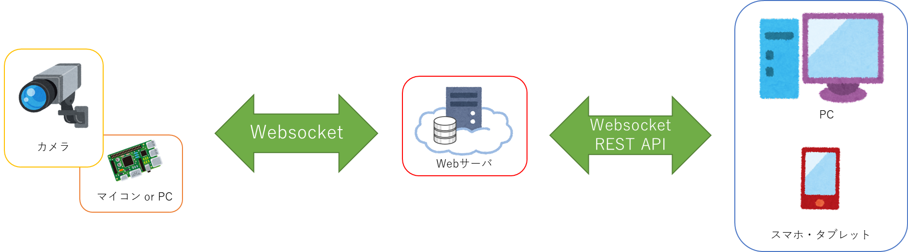

# 要件定義書

## 1. プロジェクト概要

本プロジェクトは、岩手県立大学との連携授業の一環でV字モデルでのシステム開発について学んでもらう。  
画像処理を用いた「人検知システム」のWEBアプリケーションの開発を題材として、設計・開発・試験といった一連のシステム開発を行う。

## 2. システム構成図

## 3. 前提条件

全体プロジェクトの作成およびWebsocketに関する設計書、プログラム、テスト仕様書については、東京システムズが準備を行う。  
学生は、前述のドキュメント等を参考に機能要件に記載されている機能を設計および開発を行う。

## 4. 環境要件

### 4.1. 開発環境

開発環境を以下の表に示す。
<table>
    <thead>
        <tr style="border-bottom: 1px solid black;">
            <th style="text-align: center;">システム</th>
            <th style="text-align: center;">OS</th>
            <th style="text-align: center;">開発言語</th>
            <th style="text-align: center;">開発環境</th>
        </tr>
    </thead>
    <tbody>
        <tr>
            <td>人検知システム（FE）</td>
            <td>Windows 10 | 11</td>
            <td>TypeScript</td>
            <td>
                Visual Studio Code 
                Angular
            </td>
        </tr>
        <tr>
            <td>人検出システム（BE）</td>
            <td>Windows 10 | 11</td>
            <td>Python3</td>
            <td>
                Visual Studio Code 
                mongoDB
            </td>
        </tr>
    </tbody>
</table>

### 4.2. 実行環境

実行環境を以下の表に示す。
<table>
    <thead>
        <tr style="border-bottom: 1px solid black;">
            <th style="text-align: center;">システム</th>
            <th style="text-align: center;">OS</th>
            <th style="text-align: center;">ブラウザ</th>
        </tr>
    </thead>
    <tbody>
        <tr>
            <td>人検出システム（FE）</td>
            <td>Windows 10 | 11</td>
            <td>
                Microsoft Edge 
                Google Chrome 
                Mozilla Firefox
            </td>
        </tr>
        <tr>
            <td>人検出システム（BE）</td>
            <td>
                サーバ： Ubuntu Server  
                クライアント： Raspberry Pi OS
            </td>
            <td></td>
        </tr>
    </tbody>
</table>

## 5. 非機能要件

### 5.1. 性能要件

ブラウザからの要求について、レスポンス時間の性能目標として以下の通りに示す。  
レスポンス時間とは、処理要求を送ってから出力が始まるまでの時間のことを指す。

* Websocketでのカメラへのストリーミング要求： 5秒目標
* Websocketでのデータ取得処理： １秒目標
* Websocketでの登録・更新処理： ３秒目標  

### 5.2. セキュリティ要件

ブラウザに表示される人物について、表示指定の指示が無い場合はマスキングを行い、プライバシー保護を施す。  
SQLインジェクション対策を行う。

## 6. 機能要件

### 6.1. 基本設計

<table>
    <thead>
        <tr style="border-bottom: 1px solid black;">
            <th style="text-align: center;">作成対象設計書</th>
        </tr>
    </thead>
    <tbody>
        <tr><td>画面設計書</td></tr>
        <tr><td>インターフェース仕様書</td></tr>
        <tr><td>データベース設計書</td></tr>
    </tbody>
</table>

### 6.2. 製造・単体テスト・結合テスト

<table>
    <thead>
        <tr style="border-bottom: 1px solid black;">
            <th style="width: 20%; text-align: center;">機能</th>
            <th style="text-align: center;">内容</th>
        </tr>
    </thead>
    <tbody>
        <tr>
            <td>カメラ登録画面</td>
            <td>
                Websocketサーバに接続されているカメラ情報から登録したいカメラを選択し、画像取得を行えるよう登録を行う
            </td>
        </tr>
        <tr>
            <td>カメラ一覧</td>
            <td>
                登録したカメラの一覧表示を行う 
                なお、この一覧から以下の内容が行えること
                <ul>
                    <li>登録解除</li>
                    <li>画像表示画面ダイアログの表示</li>
                </ul>
            </td>
        </tr>
        <tr>
            <td>画像表示画面</td>
            <td>
                登録しているカメラから取得した画像を表示 
                基本的に検知した人はマスキングを行うが、マスキングのON／OFFが行えること
            </td>
        </tr>
    </tbody>
</table>
