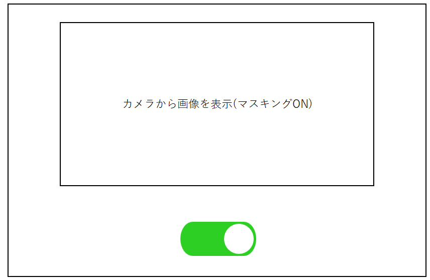

# 【画面設計書】ストリーミング画像表示画面
・登録しているカメラから取得した画像を表示する。   
・基本的に検知した人はマスキングを行うが、マスキングのON/OFFを行えるようにする。
## 1. 画面レイアウト

## 2. 入出力項目

|No|部品種類|表示|入力|入力桁数|文字種|入力制限|初期表示|アクションID|必須|項目説明|
|---|---|---|---|---|---|---|---|---|---|---|
|1|画像|カメラから取得|---|---|---|---|ON|---|〇|登録しているカメラから取得した画像|
|2|ボタン|---|---|---|---|---|ON|[1](#ボタン)|〇|マスキングのON/OFF操作を行う|

## 3. アクション明細

1. <a id="ボタン">ボタン切り替え</a>  
  ボタンがONならマスキングもONになり、ボタンがOFFならマスキングもOFFになる。
## 4. 付録
表示指定がない場合はマスキングが行われるので初期表示としてマスキング・ボタン共にONにしている。
